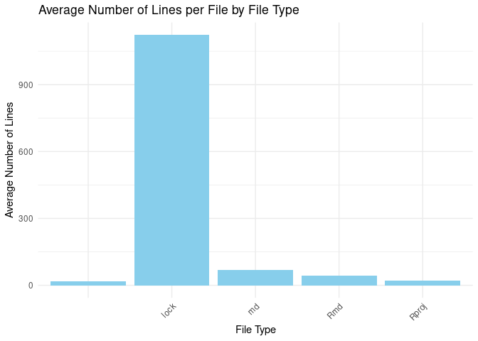

<!-- README.md is generated from README.Rmd. Please edit that file -->

# fileTypeAnalyzer

<!-- badges: start -->

[](https://github.com/jaredlander/fileTypeAnalyzer/actions/workflows/R-CMD-check.yaml)
<!-- badges: end -->

This package is the result of prompting ChatGPT to write an R pacakge as
shown in [this
talk](https://jaredlander.com/content/2023/07/LLMPackage.html) at the
2023 [NYR](https://www.rstats.ai/nyr).

## Installation

You can install the development version of fileTypeAnalyzer from
[GitHub](https://github.com/) with:

``` r
# install.packages("devtools")
devtools::install_github("jaredlander/fileTypeAnalyzer")
```

## Example

This is a basic example which shows you how to solve a common problem:

``` r
library(fileTypeAnalyzer)

fileTypeCounts('.')
#> # A tibble: 5 × 2
#>   File_Type Count
#>   <chr>     <int>
#> 1 ""            7
#> 2 "Rmd"         1
#> 3 "Rproj"       1
#> 4 "lock"        1
#> 5 "md"          1
avgLinesPerFile('.')
#> # A tibble: 5 × 2
#>   File_Type Avg_Lines
#>   <chr>         <dbl>
#> 1 ""             18.3
#> 2 "Rmd"          43  
#> 3 "Rproj"        22  
#> 4 "lock"       1123  
#> 5 "md"           70
plotAvgLinesPerFile('.', plotLibrary='ggplot')
```


